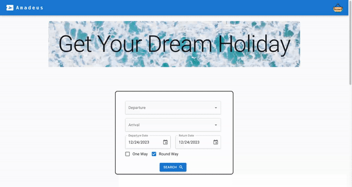

# PROJECT : Amadeus Case

## Table of contents

- [Screenshot](#screenshot)
- [Mock API](#mock-api)
- [Type Safety](#type-safety)
- [Links](#links)
- [Libraries-Tools](#libraries-tools)
- [Project Skeleton ](#project-skeleton)
- [Validation Mechanism](#validation-mechanism)
- [Author](#author)

## Screenshot

<p align="center">

</p>

## Links

- [Live Website](https://splendorous-nasturtium-b2da46.netlify.app/)

## Mock Api

- I used [json-server](https://github.com/typicode/json-server) as mock-api. I request locally to the server.
- All filtering, sorting process happen on the backend. Frontend is only responsible of UI
- Some of the data are generated by AI and some of them are generated tailor made to keep up with consistency.

- for Airports: "http://localhost:3000/airports"
- for Ticket: "http://localhost:3000/tickets"

#### Ticket queries are? :

    1. departure_airport=IST&arrival_airport=ADB
    2. departureTime_gte=2024-1-24&departureTime_lte=2025-4-2
    3. _sort=price&_order=desc

## Type Safety

Throughout the project Typescript is preferred over Javascript due to some reasons. These reasons are prevent errors beforehand and keep code more consistent and scalable. When needed advance typescript features such as generics are researched and use. The way is typescript used in this project is very dynamic and reusable. Another folder called types is created exactly for this reason.

## Links

- [Live Website](https://splendorous-nasturtium-b2da46.netlify.app/)

## Libraries-Tools

- Material UI for UI
- json-server for mock api
- React Query and Axios for API requests
- React Hook Form for form building
- dayjs for date calculation
- react testing library
- react-toastify for error throwing

## Project Skeleton

```

|----components
|----service
|----pages
|----types
|----utils
|----asset

```

## Validation Mechanism

All form fields are validated. In case of wrong input or empty required fields user is warned and forwarded with toast messages. Autocomplete and Date picker is used for forms. Chekboxes are structurd as align.

```

## Author

- Author - [Ahmet]
<p><i>All codes belong to me</i></p>
<center> &#8987; Happy Coding  &#9997; </center>
```
